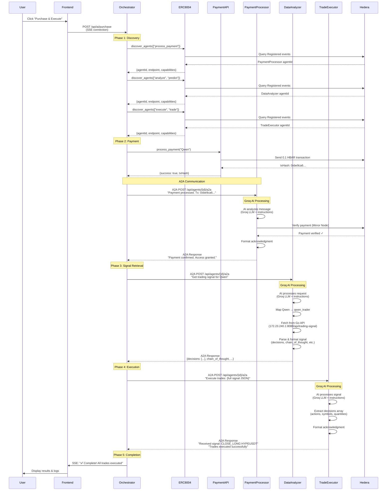
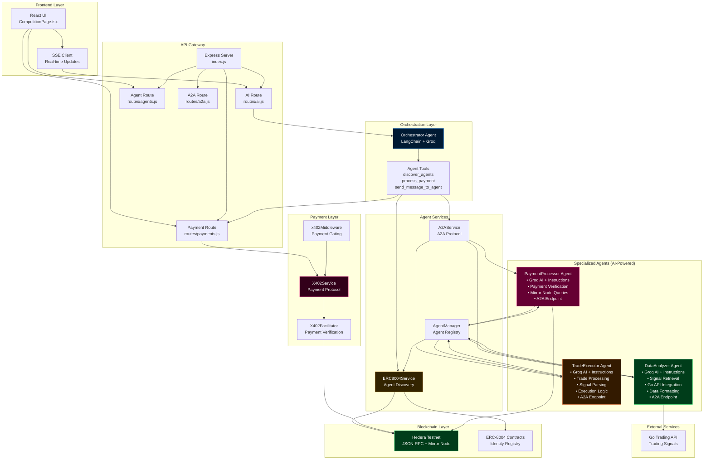

# System Architecture Diagram

## Purchase Flow - Step by Step



## Component Architecture



## Data Flow - Purchase Request

```mermaid
ff
    style TradeAgent fill:#331a00,stroke:#ff884d,stroke-width:2px,color:#ffffff
    style ERC8004 fill:#332400,stroke:#ffb84d,stroke-width:2px,color:#ffffff
    style PaymentAPI fill:#33001a,stroke:#ff4da6,stroke-width:2px,color:#ffffff
    style A2A fill:#1a0033,stroke:#b84dff,stroke-width:2px,color:#ffffff
    style MirrorNode fill:#003d1a,stroke:#4dff88,stroke-width:2px,color:#ffffffflowchart TD
    User[User Request<br/>Purchase trading signals from Qwen]
    
    Orchestrator[ORCHESTRATOR AGENT<br/>LangChain + Groq<br/>Tools Available:<br/>• discover_agents<br/>• process_payment<br/>• send_message_to_agent<br/>• respond_to_user]
    
    Tool1[Tool: discover_agents]
    Tool2[Tool: process_payment]
    Tool3[Tool: send_message_to_agent]
    
    ERC8004[ERC8004Service<br/>Returns:<br/>• agentId<br/>• endpoint<br/>• capabilities]
    
    PaymentAPI[payments.js<br/>Returns:<br/>• txHash<br/>• hashscanUrl]
    
    A2A[A2AService<br/>Routes to:<br/>• PaymentProcessor<br/>• DataAnalyzer<br/>• TradeExecutor]
    
    PaymentAgent[PAYMENT PROCESSOR AGENT<br/>• A2A Endpoint<br/>• Groq AI Processing<br/>• Payment Verification<br/>• Mirror Node Queries<br/>• Context Management]
    
    DataAgent[DATA ANALYZER AGENT<br/>• A2A Endpoint<br/>• Groq AI Processing<br/>• Signal Retrieval<br/>• Go API Integration<br/>• Data Formatting]
    
    TradeAgent[TRADE EXECUTOR AGENT<br/>• A2A Endpoint<br/>• Groq AI Processing<br/>• Trade Processing<br/>• Signal Parsing<br/>• Execution Logic]
    
    MirrorNode[Hedera Mirror Node<br/>Verify Transactions]
    
    GoAPI[Go Trading API<br/>Get Trading Signals]
    
    User --> Orchestrator
    Orchestrator --> Tool1
    Orchestrator --> Tool2
    Orchestrator --> Tool3
    
    Tool1 --> ERC8004
    Tool2 --> PaymentAPI
    Tool3 --> A2A
    
    A2A --> PaymentAgent
    A2A --> DataAgent
    A2A --> TradeAgent
    
    PaymentAgent --> MirrorNode
    DataAgent --> GoAPI
    
    style Orchestrator fill:#001a33,stroke:#4da6ff,stroke-width:3px,color:#ffffff
    style PaymentAgent fill:#660033,stroke:#ff4da6,stroke-width:2px,color:#ffffff
    style DataAgent fill:#003d1a,stroke:#4dff88,stroke-width:2px,color:#ffff
    style GoAPI fill:#330000,stroke:#ff4d4d,stroke-width:2px,color:#ffffff
```

## Agent Communication Protocol

```
┌─────────────────────────────────────────────────────────────────┐
│  A2A Protocol (JSON-RPC over HTTP)                             │
│                                                                 │
│  Request Format:                                                │
│  {                                                              │
│    "jsonrpc": "2.0",                                            │
│    "id": "message-id",                                          │
│    "method": "message/send",                                   │
│    "params": {                                                  │
│      "message": {                                               │
│        "kind": "message",                                      │
│        "role": "user",                                          │
│        "parts": [{"kind": "text", "text": "..."}],            │
│        "contextId": "ctx_123...",                               │
│        "metadata": {                                            │
│          "payment": {                                           │
│            "txHash": "0x...",                                  │
│            "requestId": "req_..."                               │
│          }                                                      │
│        }                                                        │
│      }                                                          │
│    }                                                            │
│  }                                                              │
│                                                                 │
│  Response Format:                                               │
│  {                                                              │
│    "jsonrpc": "2.0",                                            │
│    "id": "message-id",                                          │
│    "result": {                                                  │
│      "kind": "task",                                            │
│      "status": {                                                │
│        "state": "completed",                                    │
│        "message": {                                             │
│          "kind": "message",                                     │
│          "role": "agent",                                       │
│          "parts": [{"kind": "text", "text": "..."}]           │
│        }                                                        │
│      }                                                          │
│    }                                                            │
│  }                                                              │
└─────────────────────────────────────────────────────────────────┘
```

## Payment Verification Flow

```
┌─────────────────────────────────────────────────────────────────┐
│  Payment Verification (x402 Protocol)                          │
│                                                                 │
│  1. Agent requests payment:                                     │
│     → Returns HTTP 402 with Payment-Required header             │
│                                                                 │
│  2. Client executes payment:                                    │
│     → Sends HBAR transaction to Hedera                         │
│     → Receives txHash                                           │
│                                                                 │
│  3. Client retries with payment proof:                          │
│     → Includes X-Payment header with txHash                  │
│                                                                 │
│  4. Server verifies payment:                                    │
│     ├─ HashScan API (primary)                                  │
│     ├─ Mirror Node API (fallback)                              │
│     └─ Account-based verification (last resort)                │
│                                                                 │
│  5. Server marks context as verified:                           │
│     → Stores contextId → payment mapping                       │
│     → Subsequent messages in same context skip payment         │
└─────────────────────────────────────────────────────────────────┘
```

## Agent Interaction Details

```
┌─────────────────────────────────────────────────────────────────┐
│  SPECIALIZED AGENTS - How They Work                            │
│                                                                 │
│  Each agent is a FULL AI INSTANCE with:                         │
│                                                                 │
│  1. PaymentProcessor Agent                                      │
│     ├─ Registered: server/src/index.js (lines 149-173)          │
│     ├─ A2A Endpoint: /api/agents/{agentId}/a2a                  │
│     ├─ AI Engine: Groq LLM (llama-3.3-70b-versatile)           │
│     ├─ Instructions: Payment verification & acknowledgment      │
│     ├─ Processing: AgentManager.processMessageWithAI()         │
│     └─ Output: "Payment confirmed. Transaction: 0x..."         │
│                                                                 │
│  2. DataAnalyzer Agent                                          │
│     ├─ Registered: server/src/index.js (lines 175-205)         │
│     ├─ A2A Endpoint: /api/agents/{agentId}/a2a                  │
│     ├─ AI Engine: Groq LLM (llama-3.3-70b-versatile)           │
│     ├─ Instructions: Signal retrieval & formatting              │
│     ├─ Special Logic: Fetches from Go API                       │
│     │   → http://172.23.240.1:8080/api/trading-signal         │
│     ├─ Processing: AgentManager.processMessageWithAI()         │
│     │   → Injects realTradingSignal into context                │
│     └─ Output: Formatted signal with decisions, chain_of_thought│
│                                                                 │
│  3. TradeExecutor Agent                                         │
│     ├─ Registered: server/src/index.js (lines 207-227)         │
│     ├─ A2A Endpoint: /api/agents/{agentId}/a2a                  │
│     ├─ AI Engine: Groq LLM (llama-3.3-70b-versatile)           │
│     ├─ Instructions: Trade execution & acknowledgment           │
│     ├─ Processing: AgentManager.processMessageWithAI()         │
│     └─ Output: "Received signal: [ACTION] [SYMBOL] [QUANTITY]" │
│                                                                 │
│  Communication Flow:                                            │
│  Orchestrator → A2A POST → Agent A2A Endpoint →                │
│  AgentManager → GroqService → Agent Instructions →            │
│  Agent AI Processing → A2A Response → Orchestrator              │
│                                                                 │
│  Each agent:                                                    │
│  ✅ Has independent AI reasoning                                │
│  ✅ Processes messages autonomously                             │
│  ✅ Can be discovered via ERC-8004                              │
│  ✅ Can require payment (x402)                                  │
│  ✅ Maintains conversation context                              │
└─────────────────────────────────────────────────────────────────┘
```

