# What is A2A?

The A2A protocol is an open standard that enables seamless communication and
collaboration between AI agents. It provides a common language for agents built
using diverse frameworks and by different vendors, fostering interoperability
and breaking down silos. Agents are autonomous problem-solvers that act
independently within their environment. A2A allows agents from different
developers, built on different frameworks, and owned by different organizations
to unite and work together.

## Why Use the A2A Protocol

A2A addresses key challenges in AI agent collaboration. It provides
a standardized approach for agents to interact. This section explains the
problems A2A solves and the benefits it offers.

### Problems that A2A Solves

Consider a user request for an AI assistant to plan an international trip. This
task involves orchestrating multiple specialized agents, such as:

- A flight booking agent
- A hotel reservation agent
- An agent for local tour recommendations
- A currency conversion agent

Without A2A, integrating these diverse agents presents several challenges:

- **Agent Exposure**: Developers often wrap agents as tools to expose them to
    other agents, similar to how tools are exposed in a Multi-agent Control
    Platform (Model Context Protocol). However, this approach is inefficient because agents are
    designed to negotiate directly. Wrapping agents as tools limits their capabilities.
    A2A allows agents to be exposed as they are, without requiring this wrapping.
- **Custom Integrations**: Each interaction requires custom, point-to-point
    solutions, creating significant engineering overhead.
- **Slow Innovation**: Bespoke development for each new integration slows
    innovation.
- **Scalability Issues**: Systems become difficult to scale and maintain as
    the number of agents and interactions grows.
- **Interoperability**: This approach limits interoperability,
    preventing the organic formation of complex AI ecosystems.
- **Security Gaps**: Ad hoc communication often lacks consistent security
    measures.

The A2A protocol addresses these challenges by establishing interoperability for
AI agents to interact reliably and securely.

### A2A Example Scenario

This section provides an example scenario to illustrate the benefits of using an A2A (Agent2Agent) protocol for complex interactions between AI agents.

#### A User's Complex Request

A user interacts with an AI assistant, giving it a complex prompt like "Plan an international trip."


#### The Need for Collaboration

The AI assistant receives the prompt and realizes it needs to call upon multiple specialized agents to fulfill the request. These agents include a Flight Booking Agent, a Hotel Reservation Agent, a Currency Conversion Agent, and a Local Tours Agent.

```mermaid
graph LR
    subgraph "Specialized Agents"
        FBA[✈️ Flight Booking Agent]
        HRA[🏨 Hotel Reservation Agent]
        CCA[💱 Currency Conversion Agent]
        LTA[🚌 Local Tours Agent]
    end

    AI_Assistant[🤖 AI Assistant] --> FBA
    AI_Assistant --> HRA
    AI_Assistant --> CCA
    AI_Assistant --> LTA
```



#### The Interoperability Challenge

The core problem: The agents are unable to work together because each has its own bespoke development and deployment.

The consequence of a lack of a standardized protocol is that these agents cannot collaborate with each other let alone discover what they can do. The individual agents (Flight, Hotel, Currency, and Tours) are isolated.

#### The "With A2A" Solution

The A2A Protocol provides standard methods and data structures for agents to communicate with one another, regardless of their underlying implementation, so the same agents can be used as an interconnected system, communicating seamlessly through the standardized protocol.

The AI assistant, now acting as an orchestrator, receives the cohesive information from all the A2A-enabled agents. It then presents a single, complete travel plan as a seamless response to the user's initial prompt.

{ width="70%" style="margin:20px auto;display:block;" }

### Core Benefits of A2A

Implementing the A2A protocol offers significant advantages across the AI ecosystem:

- **Secure collaboration**: Without a standard, it's difficult to ensure
    secure communication between agents. A2A uses HTTPS for secure communication
    and maintains opaque operations, so agents can't see the inner workings of
    other agents during collaboration.
- **Interoperability**: A2A breaks down silos between different AI
    agent ecosystems, enabling agents from various vendors and frameworks to work
    together seamlessly.
- **Agent autonomy**: A2A allows agents to retain their individual capabilities
    and act as autonomous entities while collaborating with other agents.
- **Reduced integration complexity**: The protocol standardizes agent
    communication, enabling teams to focus on the unique value their agents
    provide.
- **Support for LRO**: The protocol supports long-running operations (LRO) and
    streaming with Server-Sent Events (SSE) and asynchronous execution.

### Key Design Principles of A2A

A2A development follows principles that prioritize broad adoption,
enterprise-grade capabilities, and future-proofing.

- **Simplicity**: A2A leverages existing standards like HTTP, JSON-RPC, and
    Server-Sent Events (SSE). This avoids reinventing core technologies and
    accelerates developer adoption.
- **Enterprise Readiness**: A2A addresses critical enterprise needs. It aligns
    with standard web practices for robust authentication, authorization,
    security, privacy, tracing, and monitoring.
- **Asynchronous**: A2A natively supports long-running tasks. It handles
    scenarios where agents or users might not remain continuously connected. It
    uses mechanisms like streaming and push notifications.
- **Modality Independent**: The protocol allows agents to communicate using a
    wide variety of content types. This enables rich and flexible interactions
    beyond plain text.
- **Opaque Execution**: Agents collaborate effectively without exposing their
    internal logic, memory, or proprietary tools. Interactions rely on declared
    capabilities and exchanged context. This preserves intellectual property and
    enhances security.

### Understanding the Agent Stack: A2A, MCP, Agent Frameworks and Models

A2A is situated within a broader agent stack, which includes:

- **A2A:** Standardizes communication among agents deployed in different organizations and developed using diverse frameworks.
- **MCP:** Connects models to data and external resources.
- **Frameworks (like ADK):** Provide toolkits for constructing agents.
- **Models:** Fundamental to an agent's reasoning, these can be any Large Language Model (LLM).

{ width="70%" style="margin:20px auto;display:block;" }

#### A2A and MCP

In the broader ecosystem of AI communication, you might be familiar with protocols designed to facilitate interactions between agents, models, and tools. Notably, the Model Context Protocol (MCP) is an emerging standard focused on connecting Large Language Models (LLMs) with data and external resources.

The Agent2Agent (A2A) protocol is designed to standardize communication between AI agents, particularly those deployed in external systems. A2A is positioned to complement MCP, addressing a distinct yet related aspect of agent interaction.

- **MCP's Focus:** Reducing the complexity involved in connecting agents with tools and data. Tools are typically stateless and perform specific, predefined functions (e.g., a calculator, a database query).
- **A2A's Focus:** Enabling agents to collaborate within their native modalities, allowing them to communicate as agents (or as users) rather than being constrained to tool-like interactions. This enables complex, multi-turn interactions where agents reason, plan, and delegate tasks to other agents. For example, this facilitates multi-turn interactions, such as those involving negotiation or clarification when placing an order.

{ width="70%" style="margin:20px auto;display:block;" }

The practice of encapsulating an agent as a simple tool is fundamentally limiting, as it fails to capture the agent's full capabilities. This critical distinction is explored in the post, [Why Agents Are Not Tools](https://discuss.google.dev/t/agents-are-not-tools/192812).

For a more in-depth comparison, refer to the [A2A and MCP Comparison](a2a-and-mcp.md) document.

#### A2A and ADK

The [Agent Development Kit (ADK)](https://google.github.io/adk-docs)
is an open-source agent development toolkit developed by Google. A2A is a
communication protocol for agents that enables inter-agent communication,
regardless of the framework used for their construction (e.g., ADK, LangGraph,
or Crew AI). ADK is a flexible and modular framework for developing and
deploying AI agents. While optimized for Gemini AI and the Google ecosystem,
ADK is model-agnostic, deployment-agnostic, and built for compatibility with
other frameworks.

### A2A Request Lifecycle

The A2A request lifecycle is a sequence that details the four main steps a request follows: agent discovery, authentication, `sendMessage` API, and `sendMessageStream` API. The following diagram provides a deeper look into the operational flow, illustrating the interactions between the client, A2A server, and auth server.


## What's Next

Learn about the [Key Concepts](./key-concepts.md) that form the foundation of the A2A protocol.

Python Quickstart Tutorial: Building an A2A Agent¶
Welcome to the Agent2Agent (A2A) Python Quickstart Tutorial!

In this tutorial, you will explore a simple "echo" A2A server using the Python SDK. This will introduce you to the fundamental concepts and components of an A2A server. You will then look at a more advanced example that integrates a Large Language Model (LLM).

This hands-on guide will help you understand:

The basic concepts behind the A2A protocol.
How to set up a Python environment for A2A development using the SDK.
How Agent Skills and Agent Cards describe an agent.
How an A2A server handles tasks.
How to interact with an A2A server using a client.
How streaming capabilities and multi-turn interactions work.
How an LLM can be integrated into an A2A agent.
By the end of this tutorial, you will have a functional understanding of A2A agents and a solid foundation for building or integrating A2A-compliant applications.

Tutorial Sections¶
The tutorial is broken down into the following steps:

Introduction (This Page)
Setup: Prepare your Python environment and the A2A SDK.
Agent Skills & Agent Card: Define what your agent can do and how it describes itself.
The Agent Executor: Understand how the agent logic is implemented.
Starting the Server: Run the Helloworld A2A server.
Interacting with the Server: Send requests to your agent.
Streaming & Multi-Turn Interactions: Explore advanced capabilities with the LangGraph example.
Next Steps: Explore further possibilities with A2A.
Let's get started!

--
# 2. Setup Your Environment

## Prerequisites

- Python 3.10 or higher.
- Access to a terminal or command prompt.
- Git, for cloning the repository.
- A code editor (e.g., Visual Studio Code) is recommended.

## Clone the Repository

If you haven't already, clone the A2A Samples repository:

```bash
git clone https://github.com/a2aproject/a2a-samples.git -b main --depth 1
cd a2a-samples
```

## Python Environment & SDK Installation

We recommend using a virtual environment for Python projects. The A2A Python SDK uses `uv` for dependency management, but you can use `pip` with `venv` as well.

1. **Create and activate a virtual environment:**

    Using `venv` (standard library):

    === "Mac/Linux"

        ```sh
        python -m venv .venv
        source .venv/bin/activate
        ```

    === "Windows"

        ```powershell
        python -m venv .venv
        .venv\Scripts\activate
        ```

2. **Install needed Python dependencies along with the A2A SDK and its dependencies:**

    ```bash
    pip install -r samples/python/requirements.txt
    ```

## Verify Installation

After installation, you should be able to import the `a2a` package in a Python interpreter:

```bash
python -c "import a2a; print('A2A SDK imported successfully')"
```

If this command runs without error and prints the success message, your environment is set up correctly.

# 3. Agent Skills & Agent Card

Before an A2A agent can do anything, it needs to define what it _can_ do (its skills) and how other agents or clients can find out about these capabilities (its Agent Card).

We'll use the `helloworld` example located in [`a2a-samples/samples/python/agents/helloworld/`](https://github.com/a2aproject/a2a-samples/tree/main/samples/python/agents/helloworld).

## Agent Skills

An **Agent Skill** describes a specific capability or function the agent can perform. It's a building block that tells clients what kinds of tasks the agent is good for.

Key attributes of an `AgentSkill` (defined in `a2a.types`):

- `id`: A unique identifier for the skill.
- `name`: A human-readable name.
- `description`: A more detailed explanation of what the skill does.
- `tags`: Keywords for categorization and discovery.
- `examples`: Sample prompts or use cases.
- `inputModes` / `outputModes`: Supported Media Types for input and output (e.g., "text/plain", "application/json").

In `__main__.py`, you can see how a skill for the Helloworld agent is defined:

```python { .no-copy }
--8<-- "https://raw.githubusercontent.com/a2aproject/a2a-samples/refs/heads/main/samples/python/agents/helloworld/__main__.py:AgentSkill"
```

This skill is very simple: it's named "Returns hello world" and primarily deals with text.

## Agent Card

The **Agent Card** is a JSON document that an A2A Server makes available, typically at a `.well-known/agent-card.json` endpoint. It's like a digital business card for the agent.

Key attributes of an `AgentCard` (defined in `a2a.types`):

- `name`, `description`, `version`: Basic identity information.
- `url`: The endpoint where the A2A service can be reached.
- `capabilities`: Specifies supported A2A features like `streaming` or `pushNotifications`.
- `defaultInputModes` / `defaultOutputModes`: Default Media Types for the agent.
- `skills`: A list of `AgentSkill` objects that the agent offers.

The `helloworld` example defines its Agent Card like this:

```python { .no-copy }
--8<-- "https://raw.githubusercontent.com/a2aproject/a2a-samples/refs/heads/main/samples/python/agents/helloworld/__main__.py:AgentCard"
```

This card tells us the agent is named "Hello World Agent", runs at `http://localhost:9999/`, supports text interactions, and has the `hello_world` skill. It also indicates public authentication, meaning no specific credentials are required.

Understanding the Agent Card is crucial because it's how a client discovers an agent and learns how to interact with it.

# 4. The Agent Executor

The core logic of how an A2A agent processes requests and generates responses/events is handled by an **Agent Executor**. The A2A Python SDK provides an abstract base class `a2a.server.agent_execution.AgentExecutor` that you implement.

## `AgentExecutor` Interface

The `AgentExecutor` class defines two primary methods:

- `async def execute(self, context: RequestContext, event_queue: EventQueue)`: Handles incoming requests that expect a response or a stream of events. It processes the user's input (available via `context`) and uses the `event_queue` to send back `Message`, `Task`, `TaskStatusUpdateEvent`, or `TaskArtifactUpdateEvent` objects.
- `async def cancel(self, context: RequestContext, event_queue: EventQueue)`: Handles requests to cancel an ongoing task.

The `RequestContext` provides information about the incoming request, such as the user's message and any existing task details. The `EventQueue` is used by the executor to send events back to the client.

## Helloworld Agent Executor

Let's look at `agent_executor.py`. It defines `HelloWorldAgentExecutor`.

1. **The Agent (`HelloWorldAgent`)**:
    This is a simple helper class that encapsulates the actual "business logic".

    ```python { .no-copy }
    --8<-- "https://raw.githubusercontent.com/a2aproject/a2a-samples/refs/heads/main/samples/python/agents/helloworld/agent_executor.py:HelloWorldAgent"
    ```

    It has a simple `invoke` method that returns the string "Hello World".

2. **The Executor (`HelloWorldAgentExecutor`)**:
    This class implements the `AgentExecutor` interface.

    - **`__init__`**:

        ```python { .no-copy }
        --8<-- "https://raw.githubusercontent.com/a2aproject/a2a-samples/refs/heads/main/samples/python/agents/helloworld/agent_executor.py:HelloWorldAgentExecutor_init"
        ```

        It instantiates the `HelloWorldAgent`.

    - **`execute`**:

        ```python { .no-copy }
        --8<-- "https://raw.githubusercontent.com/a2aproject/a2a-samples/refs/heads/main/samples/python/agents/helloworld/agent_executor.py:HelloWorldAgentExecutor_execute"
        ```

        When a `message/send` or `message/stream` request comes in (both are handled by `execute` in this simplified executor):

        1. It calls `self.agent.invoke()` to get the "Hello World" string.
        2. It creates an A2A `Message` object using the `new_agent_text_message` utility function.
        3. It enqueues this message onto the `event_queue`. The underlying `DefaultRequestHandler` will then process this queue to send the response(s) to the client. For a single message like this, it will result in a single response for `message/send` or a single event for `message/stream` before the stream closes.

    - **`cancel`**:
        The Helloworld example's `cancel` method simply raises an exception, indicating that cancellation is not supported for this basic agent.

        ```python { .no-copy }
        --8<-- "https://raw.githubusercontent.com/a2aproject/a2a-samples/refs/heads/main/samples/python/agents/helloworld/agent_executor.py:HelloWorldAgentExecutor_cancel"
        ```

The `AgentExecutor` acts as the bridge between the A2A protocol (managed by the request handler and server application) and your agent's specific logic. It receives context about the request and uses an event queue to communicate results or updates back.

# 5. Starting the Server

Now that we have an Agent Card and an Agent Executor, we can set up and start the A2A server.

The A2A Python SDK provides an `A2AStarletteApplication` class that simplifies running an A2A-compliant HTTP server. It uses [Starlette](https://www.starlette.io/) for the web framework and is typically run with an ASGI server like [Uvicorn](https://www.uvicorn.org/).

## Server Setup in Helloworld

Let's look at `__main__.py` again to see how the server is initialized and started.

```python { .no-copy }
--8<-- "https://raw.githubusercontent.com/a2aproject/a2a-samples/refs/heads/main/samples/python/agents/helloworld/__main__.py"
```

Let's break this down:

1. **`DefaultRequestHandler`**:

    - The SDK provides `DefaultRequestHandler`. This handler takes your `AgentExecutor` implementation (here, `HelloWorldAgentExecutor`) and a `TaskStore` (here, `InMemoryTaskStore`).
    - It routes incoming A2A RPC calls to the appropriate methods on your executor (like `execute` or `cancel`).
    - The `TaskStore` is used by the `DefaultRequestHandler` to manage the lifecycle of tasks, especially for stateful interactions, streaming, and resubscription. Even if your agent executor is simple, the handler needs a task store.

2. **`A2AStarletteApplication`**:

    - The `A2AStarletteApplication` class is instantiated with the `agent_card` and the `request_handler` (referred to as `http_handler` in its constructor).
    - The `agent_card` is crucial because the server will expose it at the `/.well-known/agent-card.json` endpoint (by default).
    - The `request_handler` is responsible for processing all incoming A2A method calls by interacting with your `AgentExecutor`.

3. **`uvicorn.run(server_app_builder.build(), ...)`**:
    - The `A2AStarletteApplication` has a `build()` method that constructs the actual Starlette application.
    - This application is then run using `uvicorn.run()`, making your agent accessible over HTTP.
    - `host='0.0.0.0'` makes the server accessible on all network interfaces on your machine.
    - `port=9999` specifies the port to listen on. This matches the `url` in the `AgentCard`.

## Running the Helloworld Server

Navigate to the `a2a-samples` directory in your terminal (if you're not already there) and ensure your virtual environment is activated.

To run the Helloworld server:

```bash
# from the a2a-samples directory
python samples/python/agents/helloworld/__main__.py
```

You should see output similar to this, indicating the server is running:

```console { .no-copy }
INFO:     Started server process [xxxxx]
INFO:     Waiting for application startup.
INFO:     Application startup complete.
INFO:     Uvicorn running on http://0.0.0.0:9999 (Press CTRL+C to quit)
```

Your A2A Helloworld agent is now live and listening for requests! In the next step, we'll interact with it.

# 6. Interacting with the Server

With the Helloworld A2A server running, let's send some requests to it. The SDK includes a client (`A2AClient`) that simplifies these interactions.

## The Helloworld Test Client

The `test_client.py` script demonstrates how to:

1. Fetch the Agent Card from the server.
2. Create an `A2AClient` instance.
3. Send both non-streaming (`message/send`) and streaming (`message/stream`) requests.

Open a **new terminal window**, activate your virtual environment, and navigate to the `a2a-samples` directory.

Activate virtual environment (Be sure to do this in the same directory where you created the virtual environment):

=== "Mac/Linux"

    ```sh
    source .venv/bin/activate
    ```

=== "Windows"

    ```powershell
    .venv\Scripts\activate
    ```

Run the test client:

```bash
# from the a2a-samples directory
python samples/python/agents/helloworld/test_client.py
```

## Understanding the Client Code

Let's look at key parts of `test_client.py`:

1. **Fetching the Agent Card & Initializing the Client**:

    ```python { .no-copy }
    --8<-- "https://raw.githubusercontent.com/a2aproject/a2a-samples/refs/heads/main/samples/python/agents/helloworld/test_client.py:A2ACardResolver"
    ```

    The `A2ACardResolver` class is a convenience. It first fetches the `AgentCard` from the server's `/.well-known/agent-card.json` endpoint (based on the provided base URL) and then initializes the client with it.

2. **Sending a Non-Streaming Message (`send_message`)**:

    ```python { .no-copy }
    --8<-- "https://raw.githubusercontent.com/a2aproject/a2a-samples/refs/heads/main/samples/python/agents/helloworld/test_client.py:send_message"
    ```

    - The `send_message_payload` constructs the data for `MessageSendParams`.
    - This is wrapped in a `SendMessageRequest`.
    - It includes a `message` object with the `role` set to "user" and the content in `parts`.
    - The Helloworld agent's `execute` method will enqueue a single "Hello World" message. The `DefaultRequestHandler` will retrieve this and send it as the response.
    - The `response` will be a `SendMessageResponse` object, which contains either a `SendMessageSuccessResponse` (with the agent's `Message` as the result) or a `JSONRPCErrorResponse`.

3. **Handling Task IDs (Illustrative Note for Helloworld)**:

    The Helloworld client (`test_client.py`) doesn't attempt `get_task` or `cancel_task` directly because the simple Helloworld agent's `execute` method, when called via `message/send`, results in the `DefaultRequestHandler` returning a direct `Message` response rather than a `Task` object. More complex agents that explicitly manage tasks (like the LangGraph example) would return a `Task` object from `message/send`, and its `id` could then be used for `get_task` or `cancel_task`.

4. **Sending a Streaming Message (`send_message_streaming`)**:

    ```python { .no-copy }
    --8<-- "https://raw.githubusercontent.com/a2aproject/a2a-samples/refs/heads/main/samples/python/agents/helloworld/test_client.py:send_message_streaming"
    ```

    - This method calls the agent's `message/stream` endpoint. The `DefaultRequestHandler` will invoke the `HelloWorldAgentExecutor.execute` method.
    - The `execute` method enqueues one "Hello World" message, and then the event queue is closed.
    - The client will receive this single message as one `SendStreamingMessageResponse` event, and then the stream will terminate.
    - The `stream_response` is an `AsyncGenerator`.

## Expected Output

When you run `test_client.py`, you'll see JSON outputs for:

- The non-streaming response (a single "Hello World" message).
- The streaming response (a single "Hello World" message as one chunk, after which the stream ends).

The `id` fields in the output will vary with each run.

```console { .no-copy }
// Non-streaming response
{"jsonrpc":"2.0","id":"xxxxxxxx","result":{"type":"message","role":"agent","parts":[{"type":"text","text":"Hello World"}],"messageId":"yyyyyyyy"}}
// Streaming response (one chunk)
{"jsonrpc":"2.0","id":"zzzzzzzz","result":{"type":"message","role":"agent","parts":[{"type":"text","text":"Hello World"}],"messageId":"wwwwwwww","final":true}}
```

_(Actual IDs like `xxxxxxxx`, `yyyyyyyy`, `zzzzzzzz`, `wwwwwwww` will be different UUIDs/request IDs)_

This confirms your server is correctly handling basic A2A interactions with the updated SDK structure!

Now you can shut down the server by typing Ctrl+C in the terminal window where `__main__.py` is running.

# 7. Streaming & Multi-Turn Interactions (LangGraph Example)

The Helloworld example demonstrates the basic mechanics of A2A. For more advanced features like robust streaming, task state management, and multi-turn conversations powered by an LLM, we'll turn to the LangGraph example located in [`a2a-samples/samples/python/agents/langgraph/`](https://github.com/a2aproject/a2a-samples/tree/main/samples/python/agents/langgraph).

This example features a "Currency Agent" that uses the Gemini model via LangChain and LangGraph to answer currency conversion questions.

## Setting up the LangGraph Example

1. Create a [Gemini API Key](https://ai.google.dev/gemini-api/docs/api-key), if you don't already have one.

2. **Environment Variable:**

    Create a `.env` file in the `a2a-samples/samples/python/agents/langgraph/` directory:

    ```bash
    echo "GOOGLE_API_KEY=YOUR_API_KEY_HERE" > .env
    ```

    Replace `YOUR_API_KEY_HERE` with your actual Gemini API key.

3. **Install Dependencies (if not already covered):**

    The `langgraph` example has its own `pyproject.toml` which includes dependencies like `langchain-google-genai` and `langgraph`. When you installed the SDK from the `a2a-samples` root using `pip install -e .[dev]`, this should have also installed the dependencies for the workspace examples, including `langgraph-example`. If you encounter import errors, ensure your primary SDK installation from the root directory was successful.

## Running the LangGraph Server

Navigate to the `a2a-samples/samples/python/agents/langgraph/app` directory in your terminal and ensure your virtual environment (from the SDK root) is activated.

Start the LangGraph agent server:

```bash
python __main__.py
```

This will start the server, usually on `http://localhost:10000`.

## Interacting with the LangGraph Agent

Open a **new terminal window**, activate your virtual environment, and navigate to `a2a-samples/samples/python/agents/langgraph/app`.

Run its test client:

```bash
python test_client.py
```

Now, you can shut down the server by typing Ctrl+C in the terminal window where `__main__.py` is running.

## Key Features Demonstrated

The `langgraph` example showcases several important A2A concepts:

1. **LLM Integration**:

    - `agent.py` defines `CurrencyAgent`. It uses `ChatGoogleGenerativeAI` and LangGraph's `create_react_agent` to process user queries.
    - This demonstrates how a real LLM can power the agent's logic.

2. **Task State Management**:

    - `samples/langgraph/__main__.py` initializes a `DefaultRequestHandler` with an `InMemoryTaskStore`.

        ```python { .no-copy }
        --8<-- "https://raw.githubusercontent.com/a2aproject/a2a-samples/refs/heads/main/samples/python/agents/langgraph/app/__main__.py:DefaultRequestHandler"
        ```

    - The `CurrencyAgentExecutor` (in `samples/langgraph/agent_executor.py`), when its `execute` method is called by the `DefaultRequestHandler`, interacts with the `RequestContext` which contains the current task (if any).
    - For `message/send`, the `DefaultRequestHandler` uses the `TaskStore` to persist and retrieve task state across interactions. The response to `message/send` will be a full `Task` object if the agent's execution flow involves multiple steps or results in a persistent task.
    - The `test_client.py`'s `run_single_turn_test` demonstrates getting a `Task` object back and then querying it using `get_task`.

3. **Streaming with `TaskStatusUpdateEvent` and `TaskArtifactUpdateEvent`**:

    - The `execute` method in `CurrencyAgentExecutor` is responsible for handling both non-streaming and streaming requests, orchestrated by the `DefaultRequestHandler`.
    - As the LangGraph agent processes the request (which might involve calling tools like `get_exchange_rate`), the `CurrencyAgentExecutor` enqueues different types of events onto the `EventQueue`:
        - `TaskStatusUpdateEvent`: For intermediate updates (e.g., "Looking up exchange rates...", "Processing the exchange rates.."). The `final` flag on these events is `False`.
        - `TaskArtifactUpdateEvent`: When the final answer is ready, it's enqueued as an artifact. The `lastChunk` flag is `True`.
        - A final `TaskStatusUpdateEvent` with `state=TaskState.completed` and `final=True` is sent to signify the end of the task for streaming.
    - The `test_client.py`'s `run_streaming_test` function will print these individual event chunks as they are received from the server.

4. **Multi-Turn Conversation (`TaskState.input_required`)**:

    - The `CurrencyAgent` can ask for clarification if a query is ambiguous (e.g., user asks "how much is 100 USD?").
    - When this happens, the `CurrencyAgentExecutor` will enqueue a `TaskStatusUpdateEvent` where `status.state` is `TaskState.input_required` and `status.message` contains the agent's question (e.g., "To which currency would you like to convert?"). This event will have `final=True` for the current interaction stream.
    - The `test_client.py`'s `run_multi_turn_test` function demonstrates this:
        - It sends an initial ambiguous query.
        - The agent responds (via the `DefaultRequestHandler` processing the enqueued events) with a `Task` whose status is `input_required`.
        - The client then sends a second message, including the `taskId` and `contextId` from the first turn's `Task` response, to provide the missing information ("in GBP"). This continues the same task.

## Exploring the Code

Take some time to look through these files:

- `__main__.py`: Server setup using `A2AStarletteApplication` and `DefaultRequestHandler`. Note the `AgentCard` definition includes `capabilities.streaming=True`.
- `agent.py`: The `CurrencyAgent` with LangGraph, LLM model, and tool definitions.
- `agent_executor.py`: The `CurrencyAgentExecutor` implementing the `execute` (and `cancel`) method. It uses the `RequestContext` to understand the ongoing task and the `EventQueue` to send back various events (`TaskStatusUpdateEvent`, `TaskArtifactUpdateEvent`, new `Task` object implicitly via the first event if no task exists).
- `test_client.py`: Demonstrates various interaction patterns, including retrieving task IDs and using them for multi-turn conversations.

This example provides a much richer illustration of how A2A facilitates complex, stateful, and asynchronous interactions between agents.